# Database

MySQL 8+ is the canonical target. The same migration files also render SQLite,
which is what the test suite runs on — see `app/Database/Grammars/`. Regenerate
the full DDL at any time:

```bash
php cron/console.php schema:sql mysql > schema.sql
php cron/console.php schema:sql sqlite
```

66 tables. Every tenant-scoped table carries `organisation_id`, and every
composite index on such a table leads with it.

## Conventions

| Convention | Why |
|---|---|
| `id BIGINT UNSIGNED AUTO_INCREMENT` | room to grow past 4 billion rows |
| `uuid CHAR(36)` on externally visible entities | ids never appear in a URL, an email or an API response |
| All timestamps `DATETIME`, stored **UTC** | display converts using `organisations.timezone` |
| Money `DECIMAL(16,2)` + a `currency CHAR(3)` column | never a float, never an assumed currency |
| `deleted_at` for soft deletes | `Repository::scoped()` filters it automatically |
| `*_json` / JSON columns for open-ended structure | rule trees, provider metadata, block documents |
| Append-only tables have `created_at` only | no `updated_at` on a record that must never change |

## Entity relationships

```mermaid
erDiagram
    ORGANISATIONS ||--o{ WORKSPACES : "brands"
    ORGANISATIONS ||--o{ ORGANISATION_USERS : "members"
    USERS ||--o{ ORGANISATION_USERS : "memberships"
    ROLES ||--o{ ORGANISATION_USERS : "grants"
    ROLES ||--o{ ROLE_PERMISSIONS : ""
    PERMISSIONS ||--o{ ROLE_PERMISSIONS : ""

    ORGANISATIONS ||--o{ CONTACTS : "owns"
    ORGANISATIONS ||--o{ COMPANIES : "owns"
    COMPANIES ||--o{ CONTACTS : "employs"
    CONTACTS ||--o{ CONTACT_CONSENTS : "append-only history"
    CONTACTS ||--o{ CONTACT_TAGS : ""
    TAGS ||--o{ CONTACT_TAGS : ""
    CONTACTS ||--o{ LIST_CONTACTS : ""
    LISTS ||--o{ LIST_CONTACTS : ""
    CONTACTS ||--o{ CONTACT_CUSTOM_FIELDS : ""
    CUSTOM_FIELD_DEFINITIONS ||--o{ CONTACT_CUSTOM_FIELDS : ""
    ORGANISATIONS ||--o{ SEGMENTS : "dynamic audiences"
    SEGMENTS ||--o{ SEGMENT_RULES : "mirrored rule tree"
    ORGANISATIONS ||--o{ SUPPRESSIONS : "keyed on address"

    ORGANISATIONS ||--o{ CAMPAIGNS : ""
    SEGMENTS ||--o{ CAMPAIGNS : "audience"
    TEMPLATES ||--o{ CAMPAIGNS : ""
    CAMPAIGNS ||--o{ CAMPAIGN_RECIPIENTS : "snapshot"
    CONTACTS ||--o{ CAMPAIGN_RECIPIENTS : ""
    CAMPAIGNS ||--o{ CAMPAIGN_LINKS : ""
    CAMPAIGNS ||--o{ EMAIL_MESSAGES : ""
    CONTACTS ||--o{ EMAIL_MESSAGES : ""
    EMAIL_MESSAGES ||--o{ EMAIL_EVENTS : "idempotent"

    ORGANISATIONS ||--o{ AUTOMATIONS : ""
    AUTOMATIONS ||--o{ AUTOMATION_NODES : ""
    AUTOMATION_NODES ||--o{ AUTOMATION_CONNECTIONS : ""
    AUTOMATIONS ||--o{ AUTOMATION_RUNS : ""
    CONTACTS ||--o{ AUTOMATION_RUNS : ""
    AUTOMATION_RUNS ||--o{ AUTOMATION_RUN_LOGS : ""

    ORGANISATIONS ||--o{ PIPELINES : ""
    PIPELINES ||--o{ PIPELINE_STAGES : ""
    PIPELINE_STAGES ||--o{ LEADS : ""
    CONTACTS ||--o{ LEADS : ""
    LEADS ||--o{ LEAD_STAGE_HISTORY : ""
    LEADS ||--o{ LEAD_TASKS : ""

    ORGANISATIONS ||--o{ FORMS : ""
    FORMS ||--o{ FORM_FIELDS : ""
    FORMS ||--o{ FORM_SUBMISSIONS : ""
    CONTACTS ||--o{ TRACKING_EVENTS : ""
    CONTACTS ||--o{ CONVERSIONS : ""
    CAMPAIGNS ||--o{ CONVERSIONS : "attribution"

    ORGANISATIONS ||--o{ API_KEYS : ""
    ORGANISATIONS ||--o{ WEBHOOKS : ""
    WEBHOOKS ||--o{ WEBHOOK_DELIVERIES : ""
    PLANS ||--o{ SUBSCRIPTIONS : ""
    ORGANISATIONS ||--|| SUBSCRIPTIONS : ""
    ORGANISATIONS ||--o{ USAGE_RECORDS : ""
    ORGANISATIONS ||--o{ AI_REQUESTS : ""
```



## The tables that carry the guarantees

### `contacts`

One row per person per organisation.

```
UNIQUE (organisation_id, email_normalized)   ← the deduplication guarantee
UNIQUE (organisation_id, uuid)
INDEX  (organisation_id, customer_status)
INDEX  (organisation_id, lifecycle_stage)
INDEX  (organisation_id, country)
INDEX  (organisation_id, last_purchase_at)     ← reactivation segments
INDEX  (organisation_id, last_engagement_at)
INDEX  (organisation_id, lead_score)
```

`marketing_consent_cache` and `is_suppressed_cache` are **denormalised mirrors**
maintained by `ConsentService` and `SuppressionService`. They exist only so a
list screen avoids a correlated subquery per row. **The send path never reads
them** — it re-derives from `contact_consents` and `suppressions` at queue time.
A test asserts the mirror follows the history, and another asserts the profile
screen shows the live decision rather than the mirror.

### `contact_consents` — append-only

No `UPDATE`, no `DELETE`, anywhere in the codebase. `ConsentRepository` exposes
only `record()` and readers. A change of mind is a new row; current state is the
latest row per `(contact_id, channel)`.

Each row carries the evidence: `consent_text`, `source`, `source_reference`,
`privacy_policy_version`, `terms_version`, `ip_address`, `user_agent`,
`consented_at`. Evidence you can edit is not evidence.

```
INDEX idx_consent_lookup (organisation_id, contact_id, channel, created_at)
```

### `suppressions` — the strongest gate

Keyed on the **address**, not on `contact_id`:

```
UNIQUE uniq_suppression_org_email (organisation_id, email_normalized)
```

That is what makes a suppression survive a contact being deleted, merged,
anonymised or re-imported. `email_hash` is retained so the suppression outlives
an anonymised address.

Only two code paths ever clear one, both audited: a deliberate action behind
`compliance.manage`, and a contact re-subscribing through a signed link in their
own email (which clears an `unsubscribe` suppression and nothing else).

### `campaign_recipients` — the snapshot

Written once when a campaign starts sending. The segment is **not** re-evaluated
mid-flight, so a contact added during the send cannot be half-included and the
reported audience matches what actually went out.

`eligibility_status` + `eligibility_reason` store the `ReasonCode` from
`ComplianceService`, which is why a campaign report can say *why* 112 people were
skipped rather than just that they were.

`send_status` moves `pending → queued → sent`, and the `queued → sent` step is a
conditional UPDATE (`claimForSending()`). That single statement is what makes the
send job idempotent: a redelivered queue message claims nothing and sends
nothing.

Completeness lives on the campaign, not here: `campaigns.snapshot_completed_at`
is stamped only when the whole audience has been written. A build interrupted
part-way leaves it null, and the dispatcher resumes from
`MAX(contact_id)` for that campaign — which is correct because rows are written
in contact-id order.

```
UNIQUE uniq_campaign_contact (campaign_id, contact_id)
```

The unique index is the backstop: a resumed build that overlapped its watermark
cannot write a contact twice, so nobody receives the same campaign twice.

### `email_events` — idempotent by index

```
UNIQUE uniq_provider_event (provider, provider_event_id)
```

Providers redeliver. `ProviderEventProcessor` inserts and lets the index reject
the duplicate — a `SELECT`-then-`INSERT` check would race. A redelivered open
does not increment a count twice; a test proves it.

### `compliance_rules` — versioned

```
UNIQUE uniq_rule_version (organisation_id, country, rule_code, version)
```

Existing versions are never modified. A rule change is a new row with a later
`version` and an `effective_from`, so a send made last year can still be
explained with the rules that were in force at the time. Lookup order:
organisation override → platform default for the country → wildcard.

### `audit_logs` vs `activity_logs`

| | `audit_logs` | `activity_logs` |
|---|---|---|
| Purpose | security and compliance forensics | Customer 360 timeline |
| Written by | `AuditService` | `ActivityService` |
| Volume | low | high (every open, click, tag) |
| Mutable | never | never |
| Retention | long | rotatable |

They are separate so engagement volume can never push the records that matter
for compliance out of view. `AuditService` redacts credentials before writing;
a test asserts a password, an API key and a token hash never reach the table.

## Indexing strategy at scale

Targets: 1M contacts, tens of millions of email events, 100k+ recipient
campaigns per organisation.

- Every composite index leads with `organisation_id`, so a tenant's working set
  stays contiguous and one large tenant does not degrade another's queries.
- The scheduler's scans are covered: `campaigns(status, scheduled_at)`,
  `automation_runs(status, resume_at)`, `webhook_deliveries(status, next_attempt_at)`,
  `jobs(queue, reserved_at, available_at)`.
- Event tables are append-only and partition-ready on `event_at` / `occurred_at`.
- Segment counts are cached on `segments` and refreshed by cron: recomputing a
  million-row segment on page render is not acceptable.
- Batch work streams. `Connection::cursor()`, `ContactRepository::stream()` and
  `QueryBuilder::chunkById()` use keyset pagination, so cost does not grow with
  depth. Nothing calls `fetchAll()` on a recipient set.

## Foreign keys

Used where cascade behaviour should be the database's job — `contact_tags`,
`list_contacts`, `segment_rules`, `automation_nodes`, `form_fields`,
`webhook_deliveries`. Deliberately **not** used on high-volume append-only event
tables (`email_events`, `tracking_events`, `activity_logs`), where the write cost
and the lock contention are not worth it and orphan rows are harmless.

`organisation_users.role_id` and `subscriptions.plan_id` use `ON DELETE RESTRICT`:
deleting a role that people hold, or a plan someone is on, should fail loudly.

## Migrations

```bash
php cron/console.php migrate           # apply
php cron/console.php migrate:status    # what is applied
php cron/console.php migrate:rollback  # undo the last batch
php cron/console.php migrate:fresh     # rebuild (never in production)
```

Migrations are batched, so a rollback undoes exactly one deploy. DDL is not
transactional in MySQL, so each migration is applied independently and the log
records precisely what succeeded.

**Write migrations backward-compatible for one release** — add a column, backfill,
switch reads, remove in the next release — so a rollback does not strand the
schema against the previous code.
